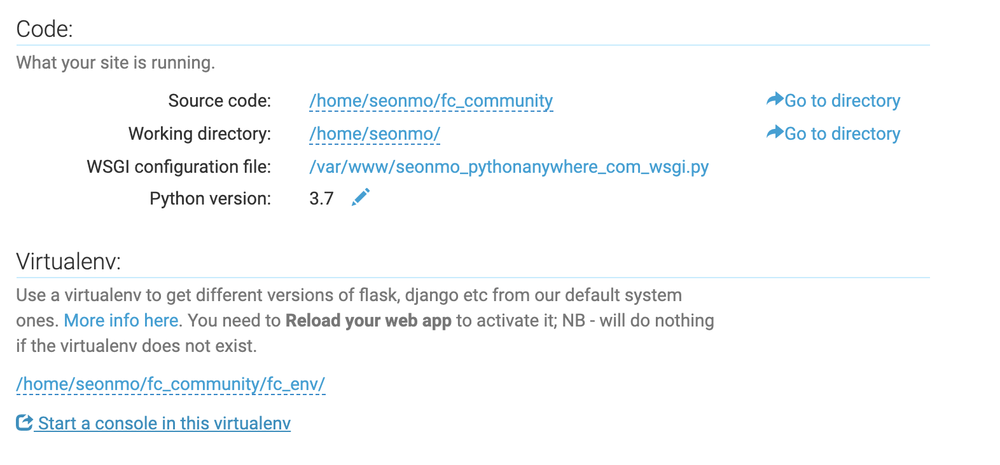

# django basic

## 가상환경설정

1. 가상환경설치 - pip3 install virtualenv
1. 가상환경생성 - virtualenv fcdjango_venv
1. 현재사용할 가상환경설정 - source bin/activate

## django

-   설치 : `pip3 install django`
-   프로젝트 생성 : `django-admin startproject fc_communtiy`
-   app 생성  
    `django-admin startapp board`  
    `django-admin startapp fcuser`

## django app 등록

```python
# setting.py에 app 추가
INSTALLED_APPS = [
    ...,
    'board',
    'fcuser',
]
```

## django Model 생성

```python
from django.db import models

# Create your models here.
class Fcuser(models.Model):
	# filed : username, password, registered_dttm
	username = models.CharField(max_length=64, verbose_name='사용자명')
	password = models.CharField(max_length=64, verbose_name='비밀번호')
	registered_dttm = models.DateTimeField(auto_now_add=True, verbose_name='등록시간')

	class Meta:
		# table name 지정
		db_table = 'fastcampus_fcuser'
```

-   `makimigrations`- models.py에서 적용한 변경사항이나 추가된 혹은 삭제된 사항들을 감지하여 파일로 생성
    -   명령어실행 : python3 manage.py makemigrations
-   `migrate` - 적용되지 않은 migrations들을(설정값들을) 적용시키는 역할
    -   명령어실행 : python3 manage.py migrate

## django admin

-   기본적으로 setting.py 에 활성화 되어있음
-   도메인/admin 으로 접속( default urls.py에 설정되어있음)

### 계정생성

-   python3 manage.py createsuperadmin
    1. 명령어 실행
    1. name, email, password 지정 / admin, admin@admin.com, 12qwaszx!@
-   run server
    -   python3 manage.py runserver <0.0.0.0:port>

## admin화면 models 표출하기

-   app package의 admin.py를 작성해야한다.

```python
# board > models.py
from django.db import models

class Board(models.Model):
    objects = None
    title = models.CharField(max_length=128, verbose_name='제목')
    contents = models.TextField(verbose_name='내용')
    writer = models.ForeignKey(
        'fcuser.Fcuser', on_delete=models.CASCADE, verbose_name='작성자')
    registered_dttm = models.DateTimeField(
        auto_now_add=True, verbose_name='등록시간')

    def __str__(self):
        return self.title

    class Meta:
        # table name 지정
        db_table = 'fastcampus_board'
        # admin 게시판에 보여줄 명
        verbose_name = '패스트캠퍼스 게시글'
        verbose_name_plural = '패스트캠퍼스 게시글들'

---

# board > admin.py

from django.contrib import admin
from .models import Board

class BoardAdmin(admin.ModelAdmin):
    list_display = ('title', 'writer') # 리스트에 표출 할 속성

admin.site.register(Board, BoardAdmin)  # admin에 등록

```


## model과 model 관계설정

```python
# 1(Fcuser) :  n(Board)
# n(TAG)    :  m(Board)
# Board
class Board(models.Model):
    ...
    writer = models.ForeignKey(
        'fcuser.Fcuser', on_delete=models.CASCADE, verbose_name='작성자')
    tags = models.ManyToManyField('tag.Tag', verbose_name='태그')
    ...
```

## PythonAnywhere 배포준비

```python
# setting.py
# 1. DEBUG False 로 변경
DEBUG = False

# 2. 허용할 HOST
ALLOWED_HOSTS = [
    'seonmo.pythonanywhere.com'
]

# 3. STATIC_ROOT
"""
STATICFILES_DIRS 은 개발 단계에서 사용하는 정적 파일이 위치한 경로들을 지정하는 설정 항목이므로 주석처리한다.
STATICFILES_DIRS = [
    os.path.join(BASE_DIR, 'static')
]
STATIC_ROOT는 Django 프로젝트에서 사용하는 모든 정적 파일을 한 곳에 모아넣는 경로입니다
한 곳에 모으는 기능은 manage.py 파일의 collectstatic 명령어로 수행한다,
"""
STATIC_ROOT = os.path.join(BASE_DIR, 'static')
```

# pythonanywhere 배포하가

1. project 압축( zip)
2. pythonanywhere zip upload
3. pythonanywhere - top: [Files] Menu click
    - 상단 `open Bash console here` click
4. unzip fc_community.zip
5. virtualenv --python=python3.7 fc_env
6. source fc_env/bin/activate
7. pip install django
8. cd fc_commuvity
9. python manage.py collectstatic
10. python manage.py migrate
11. pythonanywhere - top: [Web] Menu click
12. Web 생성
13. Web Configuration - 자신의 환경에 맞게 설정
    - Code : Source code
    - WSGI configuration file
    - Virtualenv : 경로설정
    - static : 경로설정
14. Reload : reload button click

-   Code / Virtualenv
    
-   WSGI
    
-   Static files
    
-   Reload
    

# Tip

-   django 버전확인 : python3 -m django --version
-   makemigrations 실행 후 model detected 못할때는 `python manage.py makemigrations myapp` app이름 명시해 하도록 한다.
